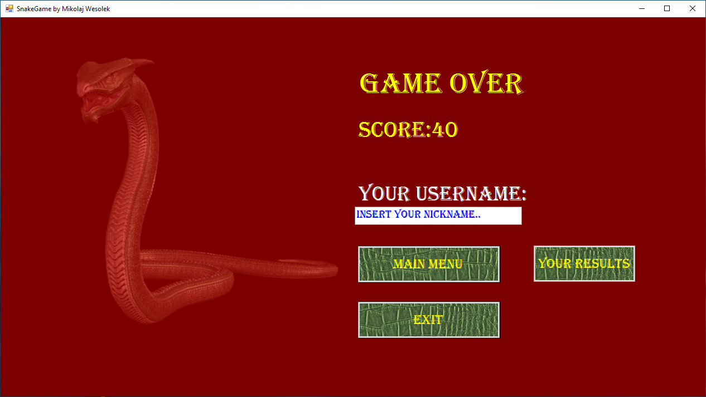

# SNAKE GAME
SNAKE GAME created in C# with database connection. The game has a Graphical interface with multople views.
The player must collect as many points as possible. Difficulty level increases as points increase, because the snake gets bigger.
##
## Setup
To run this project with fully functional , you need a database connection with database structure,like that:

And change database path in file snakeGame.cs at line 20.
```
private string pathDatabase = @"Data Source=(localdb)\MSSQLLocalDB;Initial Catalog=master;Integrated Security=True;Connect Timeout=30;Encrypt=False;TrustServerCertificate=False;ApplicationIntent=ReadWrite;MultiSubnetFailover=False";
```
## Screenshots
Main Window:

Game:

Game Over Window:

Player Result:

Top 10:

Options:

Available Resolution:

Speed Option:

Blue Board:

White Board:

